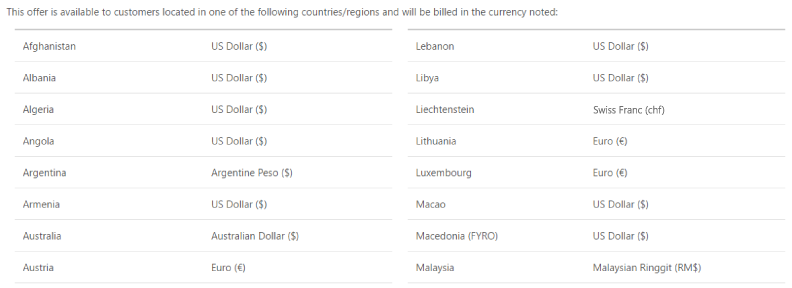

# Currency

## Currency names

In general, lowercase the names of currencies, but capitalize the reference to the country or region. 

**Examples** US dollar Canadian dollar Hong Kong SAR dollar Brazilian real South African rand Pricing through the Microsoft Online Subscription Program is shown in US dollars.

In
a structured list, for example a table that compares available pricing
options, it's OK to capitalize the name of the currency.

**Example**

## Specific monetary amounts

When you're referencing specific amounts of money, use the currency code, followed by the amount, with no space.

**Example** The company generated BRL2.89 billion (USD1.42 billion) in net revenue in 2015. 

If it's clear which currency you mean, it's OK to use just the symbol. When referring to a specific amount in euros, use the euro symbol (€), not the word *euros.*

**Examples** One of the largest companies in the United States, Adatum Corporation generated $1.42 billion in net revenue in 2015. Adatum Corporation generated €1.42 billion in net revenue in 2015. 

## Official currency names and codes

Use the names and codes listed on the [Regional Formats page](https://microsoft.sharepoint.com/teams/celaGlobalReadiness/Pages/Regional-Format.aspx "Regional Formats page on the Global Readiness website") on the [Global Readiness](https://microsoft.sharepoint.com/teams/celaGlobalReadiness/Pages/Home.aspx) website. (This page requires Microsoft network access.)

To find a currency name or code:

1.  Select a locale, and then select **Search**.
2.  Expand the Currency section, and look for the English Currency Name or International Currency Code.

**See also** [euro](/style-guide/a-z-word-list-term-collections/e/euro)
