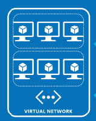

# Illustrating network traffic flows

When
you need to create a graphical representation of network traffic
using industry or proprietary protocols, follow these guidelines.
Always include a legend that explains the visual conventions.

## Use colors carefully

Use
a consistent color, such as white, gray, or a light accent color,
for important elements in the network diagram. Accentuate with
additional colors. Text, graphics, and lines
should contrast with the background to support people with limited
vision.

## Use consistent text formatting

Use sentence-style capitalization. To learn more, see [Capitalization](~/capitalization.md).

## Represent communication with arrows, lines, and labels

**Use arrows to indicate which computer initiates communication.**
Use a single-headed arrow to indicate a single initiator of
communication. Use a double-headed arrow to indicate that the
computer shown at either end of the arrow can initiate
communication. 

With both types of arrows, subsequent communication is two-way.

  

**Use line styles to distinguish different traffic flows.** Choose line colors that contrast with the image background 
and are distinct when printed or viewed in black and white.

  

**Label specific network traffic.** If possible, overlay the label onto the line: 

  

Otherwise, add the label as a callout:

## Represent security boundaries with solid vertical lines

Use
a solid vertical line to indicate a security boundary. Draw lines
that indicate network traffic flow across the vertical line. This
example shows firewalled and partitioned networks in Microsoft
Azure.

## Use standard network traffic syntax

Use the following syntax to create the label for the network traffic flow:

*SUBSUBPROT/SUBPROT/PROT/TCP SourceRange-\>DestRange,UDP SourceRange-\>DestRange*

**SUBSUBPROT/SUBPROT/PROT** List
the protocols using their standard industry acronym or name, from the
highest in the protocol stack to the lowest. For example,
XMPP/MTLS. 

**"/TCP," "/UDP," or "/TCP\&UDP"** Indicate
whether the following ports are for TCP traffic, UDP traffic,
or a combination of TCP and UDP traffic ("/TCP *SourceRange*-\>*DestRange*,UDP *SourceRange*-\>*DestRange"*). If
both TCP and UDP use the same set of ports, use "/TCP\&UDP."
You can omit "/TCP" if the traffic is known to be TCP traffic only.
UDP traffic must be indicated with "/UDP *SourceRange*-\>*DestRange."*

**SourceRange-\>DestRange** Use the *SourceRange* and *DestRange*
values to indicate the source and destination ports for TCP or UDP
traffic. There can be multiple sets of source and
destination ranges. For four-digit and five-digit port numbers,
omit the comma separating the thousands. For example, use "41239,"
not "41,239." *SourceRange* and *DestRange*
can be a single TCP or UDP port, a port range, multiple
individual ports, multiple ranges, or a combination of individual
ports and port ranges (each separated by a comma) in the order in
which they’re used. You can omit port numbers if they're
known. Use "dyn" to indicate dynamically allocated source ports
(also known as "ephemeral ports"). Omit "dyn-\>" if the initiator
uses only dynamic ports. 

**Examples of explicitly stated protocols and source and destination ports**|**Examples that omit "/TCP," known ports, and dynamic source ports**
--|--
HTTP/TCP dyn->80|HTTP
HTTP/TCP dyn->443|HTTPS
HTTP/TCP dyn->8080|HTTP 8080
HTTP/TCP dyn->53|DNS/TCP&UDP
SRTP/TCP&UDP dyn->50000-59999|SRTP/TCP&UDP 50000-59999
CIFS/TCP dyn->135,445|CIFS 135,445
STUN/UDP dyn->3478|STUN/UDP 3478
SIP/TLS/TCP dyn->444|SIP 444
XMPP/MTLS/TCP dyn->23456|XMPP/MTLS 23456
ABC/TCP 123->456|ABC 123->456
