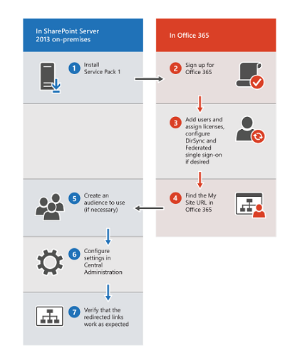
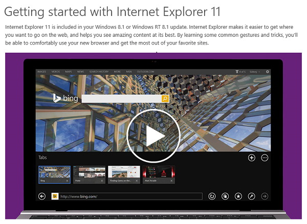

# Procedures and instructions

The
best procedure is the one you don’t need. If the UI is crystal
clear and leads the customer through a task, a procedure
isn’t necessary. Start there. See [UI text and design](/style-guide/ui-text-content-design) for tips.

Some tasks are more complex. When you need to provide a procedure, look for the clearest way to present it. That might be:

  - A picture, an illustration, a poster, or an infographic
    
  - A video.

  - A one-sentence instruction.

  - A numbered
    procedure, which might include pictures, videos, and links or
    buttons that take customers where they need to go.

When
a procedure is the best approach, use the guidelines in this
section to create consistent instructions that are easy to follow:

  - [Writing step-by-step instructions](/style-guide/procedures-instructions/writing-step-by-step-instructions) describes several ways to write simple and complex instructions.
  - [Describing interactions with UI](/style-guide/procedures-instructions/describing-interactions-with-ui) provides a list of input-neutral verbs you can use to write instructions that work with any input method.
  - [Describing alternative input methods](/style-guide/procedures-instructions/describing-alternative-input-methods) explains how to describe customer interactions with UI using mouse, keyboard, joystick, pen, touch, and sensor input—and how to consolidate more than one method in instructions. 
  - [Formatting text in instructions](/style-guide/procedures-instructions/formatting-text-in-instructions) lists the formatting conventions for elements commonly used in instructions.

**Note:** Document all the ways that customers can interact with your UI, to comply with [Microsoft Accessibility Standards (MAS)](https://microsoft.sharepoint.com/teams/msenable/Pages/AccessibilityStandard.aspx) requirements
and support customers of all abilities. This includes mouse,
keyboard, voice recognition, game controller, gesture, and any
other input method or device that the product or service supports. The
easiest way to approach this is to fully document interactions using
each input method, and then write procedures that
use input-neutral verbs. 
