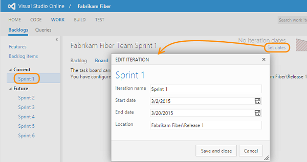

# Writing step-by-step instructions

Follow these guidelines to help you create clear, easy-to follow instructions,
whether you're writing simple, single-step procedures or complex
procedures that consist of multiple steps.

**See also**  
[Formatting text in instructions](/style-guide/procedures-instructions/formatting-text-in-instructions)  
[Formatting punctuation](/style-guide/punctuation/formatting-punctuation)  

## Complex procedures

Complex instructions often consist of multiple steps formatted as a
numbered list. For multiple-step procedures in numbered lists: 

  - Format procedures consistently so customers can find them easily by scanning.  
  
  - Consider using a heading to help customers find instructions quickly. Use the heading to tell customers what the instructions will help them do.  
    **Examples**  
    To add an account  
    Add an account  
     
    Choose one phrasing style for the headings, and write them all the same way (in parallel structure).  
    
  - Use a separate numbered entry for each step. It's OK to combine short steps that occur in the same place in the UI.  
  
  - Most of the time, include actions that finalize a step, such as OK or Apply buttons.  
  
  - Use complete sentences.  
  
  - Use [imperative verb forms](/style-guide/grammar/verbs). In instructions, customers really want you to tell them what to do.  
  
  - Use consistent sentence structures. For example, always use a phrase when you need to tell the customer where to start. The rest of the time, start each sentence with a verb.  
    **Examples**  
    On the ribbon, go to the **Design** tab.  
    Open Photos.  
    For **Alignment**, choose **Left**.  
    
  - Capitalize the first word in each step.  
  
  - Use a period after each step.  
    **Exception**  
    When instructing customers to type input that doesn't include end punctuation, don’t use a period. Try to format the text 
    so that the user input appears on a new line.  
    
  - Limit a procedure to seven steps, and preferably fewer. Try to fit all the steps on the same screen. 
    **Examples**

    **To create a group of tiles**

    1.  On the Start screen, select the tiles you want to group together. 
    2.  Drag them to an open space. When a gray bar appears behind them, release the tiles to create the new group. 

    **To schedule sprints**

    1.  In the **Backlogs** view, select the first sprint under **Current**. Or, open your sprint backlog from the following URL:
    [http://AccountName/DefaultCollection/TeamProjectName/\_backlogs/iteration](http://accountname/DefaultCollection/TeamProjectName/_backlogs/iteration)  
    Several predefined sprints are listed under **Current** and **Future**. Actual sprint titles vary based on the [process template](https://msdn.microsoft.com/library/ms400752.aspx) used to create your team project. However, calendar dates haven’t been assigned.
    2.  To set the calendar dates, select the first sprint under **Current**, and select dates.   

    

## Single-step procedures

If you're using a consistent format for step-by-step instructions,
use the same format for single-step instructions, but replace the
number with a bullet.  
**Example**  
**To move a group of tiles**  

  - On the Start screen, zoom out and drag the group where you want.

## Tips for writing steps

Make sure the customer knows where the action should take place before you describe the action. 

  - If the instruction appears in the same UI where the action occurs, it’s usually not necessary to provide location details.  
  
  - If you need to make sure the customer begins in the right place, provide a brief phrase at the beginning of the step.  
    **Example**  
    On the **Design** tab, select **Header Row**.  
    
  - If there’s a chance of confusion, provide an introductory step.  
    **Example**  
    On the ribbon, go to the **Design** tab.

## Simple instructions with right angle brackets

Abbreviate simple sequences by using right angle brackets. Include a
space before and after each bracket, and don't make the
brackets bold. 

**Example**  
Select **Accounts** \> **Other accounts** \> **Add an account**.

**Accessibility tip** Screen readers may skip over brackets and read instructions such as **Menu** \> **Go To** \> **Folders** as *Menu Go To Folders,* which might confuse customers. Check with an accessibility expert before using this approach.
