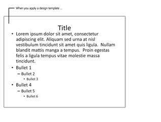
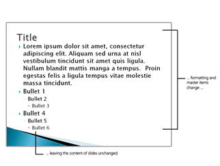

# Ellipses

HTML code &\#0133;

In
general, don’t use an ellipsis (…) except in the situations
described here or to indicate omitted code in technical content. 

It's OK to use an ellipsis to indicate a pause in conversational UI messages.  
**Example** *(Hmm ... looks like that link is broken.)*

When there's an ellipsis in UI, don’t include it in instructions or procedures.  
**Example** Select **Safety**, and then **Delete browsing history**.

In quoted material, use an ellipsis to indicate omitted text.

  - If the ellipsis replaces text within a sentence, include a space before and after the ellipsis.

 **Example** The quick brown fox … lazy dog.

  - If
    the ellipsis replaces the end of a quoted sentence, include a
    space before the ellipsis and follow it with a closing period,
    with no intervening space. 

 **Example** The quick brown fox ….

It’s OK to use an ellipsis in multiple-part callouts, especially with screenshots or graphics in documentation. 

  - Ensure that the path through the callouts is clear. Document each step.
  - Insert a space and then an ellipsis at the end of a phrase that continues later.
    Insert an ellipsis followed by a space at the beginning of a phrase that's continued from a previous phrase.
  - If
    the callout ends with additional punctuation, such as a
    period or comma, insert a space between the punctuation mark and
    the ellipsis.

If
you're writing in an environment that doesn't have the Segoe
font and using a font that doesn't have the
ellipsis character, use three periods with no space between them.
